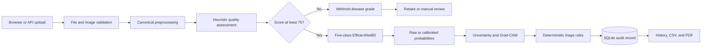
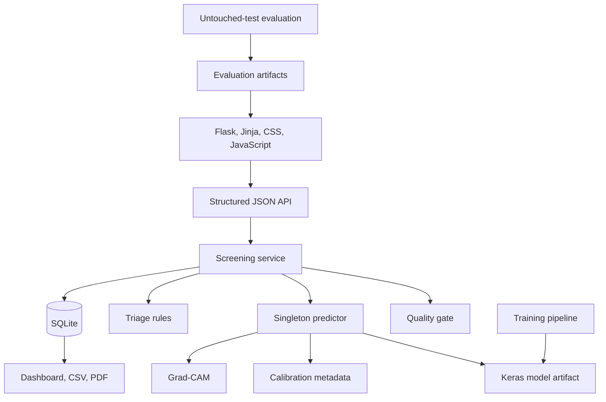

# RetinaTriage AI

> Explainable, quality-gated diabetic-retinopathy screening for research demonstrations and software engineering experiments.

[](https://www.python.org/)
[](https://flask.palletsprojects.com/)
[](LICENSE)
[](docs/MEDICAL_DISCLAIMER.md)

RetinaTriage AI is a full-stack Flask application for demonstrating an auditable retinal fundus screening workflow. It validates the uploaded image, calculates a transparent heuristic image-quality score, withholds automated grading when the score is below **75/100**, runs a five-class EfficientNetB0 model when the quality gate passes, estimates uncertainty, generates Grad-CAM visualizations, assigns a review priority, and stores a de-identified screening record.

The repository includes the browser interface, JSON API, database layer, presentation samples, model installer, training and evaluation pipeline, automated tests, and presentation runbook needed to demonstrate the project end to end.

> [!CAUTION]
> **Research and educational use only.** RetinaTriage AI is not a medical device, has not been prospectively or externally validated, and must not be used for diagnosis, treatment, emergency triage, autonomous patient communication, or replacement of a qualified eye-care professional. Model confidence is not the probability that a diagnosis is correct. See the [medical disclaimer](docs/MEDICAL_DISCLAIMER.md) and [model card](docs/MODEL_CARD.md).

## Table of contents

- [Project status](#project-status)
- [Capabilities](#capabilities)
- [Decision workflow](#decision-workflow)
- [Quality gate and manual review](#quality-gate-and-manual-review)
- [Model output and triage](#model-output-and-triage)
- [Repository structure](#repository-structure)
- [Requirements](#requirements)
- [Quick start](#quick-start)
- [Professional presentation](#professional-presentation)
- [Configuration](#configuration)
- [API](#api)
- [Dataset preparation, training, and evaluation](#dataset-preparation-training-and-evaluation)
- [Validation and limitations](#validation-and-limitations)
- [Security, privacy, and persistence](#security-privacy-and-persistence)
- [Credits and provenance](#credits-and-provenance)
- [Licensing](#licensing)
- [What to commit to GitHub](#what-to-commit-to-github)
- [Troubleshooting](#troubleshooting)
- [Contributing](#contributing)

## Project status

| Area | Current state |
|---|---|
| Web application | Implemented: command centre, single analysis, batch screening, model intelligence, history, and responsible-use pages |
| Inference | Real five-class Keras model; no mocked or random disease predictions |
| Demonstration model | Checksum-pinned download from `Aldahmashi/DR-EfficientNetB0`; model binary is intentionally not stored in Git |
| Confidence | Raw softmax for the supplied demonstration model and explicitly marked **uncalibrated** |
| Quality gate | Composite heuristic score; **75/100 or above passes**, **below 75 requires retake/manual review** |
| Explainability | Grad-CAM visualization when the installed model architecture exposes a compatible convolutional layer |
| Audit trail | SQLite records, searchable history, CSV export, deletion, and PDF reports |
| Tests | Offline test suite plus an end-to-end presentation verifier |
| Clinical readiness | Not clinically validated and not approved for clinical use |

If a compatible model artifact is missing, the application still starts and reports **MODEL NOT INSTALLED**. Prediction requests return `503 MODEL_UNAVAILABLE`; the application never substitutes a hard-coded or random result.

## Capabilities

- JPEG and PNG upload with extension, decoded-content, size, and decompression checks
- EXIF orientation correction, retinal-field crop, square padding, resizing, and optional CLAHE
- Inspectable quality checks for resolution, blur, brightness, exposure, contrast, and field coverage
- Five diabetic-retinopathy severity grades and derived referable/high-risk probabilities
- Confidence, predictive entropy, top-two margin, and deterministic manual-review rules
- Grad-CAM overlay for a visual indication of regions influencing the model output
- Single-image analysis and bounded, partial-success batch processing
- Anonymous case IDs with no patient demographic fields
- SQLite screening history, filtering, CSV export, record deletion, and PDF report generation
- Dataset adapters, content-hash duplicate prevention, and reproducible stratified manifests
- Two-stage EfficientNetB0 transfer learning, temperature fitting, and locked-test evaluation tools
- Evaluation metrics for ordinal grading, class performance, binary screening, calibration, and latency
- Presentation asset installer with pinned revision and SHA-256 verification
- Reusable public-domain/CC0 presentation images with source attribution

## Decision workflow





## Quality gate and manual review

The acceptance threshold is defined by `quality.minimum_score` in [`configs/default.json`](configs/default.json) and is currently `0.75`.

- A composite score of **75/100 or higher** passes the software quality gate.
- A composite score **below 75/100** fails the gate. The application withholds the disease prediction and displays **Retake / manual review required**.
- Individual quality observations, such as possible blur, remain visible even when the composite score passes.
- Passing the gate means only that the image passed this heuristic. It does not establish clinical gradability, diagnostic correctness, or safety.
- The threshold must not be changed for a real study without a documented validation and governance process.

The score combines resolution, Laplacian blur, brightness/exposure, contrast, and estimated retinal-field coverage. The response includes the component measurements, configured limits, final score, decision, and disclaimer so that the gate is inspectable rather than hidden.

## Model output and triage

| Grade | Application label | Default priority |
|---:|---|---|
| 0 | No Apparent Diabetic Retinopathy | Routine |
| 1 | Mild Non-Proliferative Diabetic Retinopathy | Follow-up |
| 2 | Moderate Non-Proliferative Diabetic Retinopathy | Specialist review |
| 3 | Severe Non-Proliferative Diabetic Retinopathy | High priority |
| 4 | Proliferative Diabetic Retinopathy | Urgent/high priority |

The application derives:

- **Referable DR probability:** sum of grades 2–4
- **High-risk DR probability:** sum of grades 3–4
- **Confidence:** highest class probability
- **Predictive entropy:** uncertainty across all five class probabilities
- **Top-two margin:** difference between the two highest class probabilities

After an image passes the quality gate, manual review can still be triggered by a confidence below `0.60`, entropy above `1.25`, top-two margin below `0.15`, or high-risk probability at or above `0.35`. Grade and risk rules can also escalate priority. These defaults are software demonstration settings, not clinically approved thresholds.

The supplied presentation model uses raw softmax output because compatible validation logits were not distributed with the model. The interface therefore labels its confidence as **uncalibrated**. Models trained through this repository can produce a fitted temperature and validation-derived operating points; those artifacts still require independent validation before any clinical interpretation.

## Repository structure

```text
RetinaTriage/
├── app.py                         # Flask development entry point
├── configs/                       # Versioned application/training configuration
├── data/                          # Ignored raw/processed data; tracked placeholders only
├── demo/
│   ├── samples/                   # Small redistributable presentation images
│   └── ATTRIBUTION.md             # Image provenance and rights
├── artifacts/
│   ├── models/                    # Ignored model binary; tracked metadata/calibration
│   ├── training/                  # Generated training outputs, ignored
│   ├── evaluation/                # Generated evaluation outputs, ignored
│   └── reports/                   # Generated PDF reports, ignored
├── docs/                          # Architecture, model, data, validation, and demo guides
├── scripts/                       # Setup, verification, diagnostics, launch, and download tools
├── src/
│   ├── data/                      # Adapters, preprocessing, quality, and splitting
│   ├── database/                  # SQLite schema and repository
│   ├── inference/                 # Predictor, triage, and Grad-CAM
│   ├── modeling/                  # Architecture, losses, calibration, and metrics
│   ├── services/                  # Screening persistence and PDF reports
│   ├── training/                  # Training and untouched-test evaluation
│   └── web/                       # Flask factory, page routes, and JSON API
├── static/                        # CSS and vanilla JavaScript
├── templates/                     # Jinja interface templates
├── tests/                         # Offline automated tests
├── .env.example                   # Non-secret environment variable template
├── THIRD_PARTY_NOTICES.md         # Model, dataset, and image licensing details
├── LICENSE                        # MIT license for original project code/docs
└── README.md
```

## Requirements

- Python 3.11–3.13 on a platform supported by TensorFlow 2.20
- Approximately 2 GB of free space for the Python environment; the downloaded model itself is 33.4 MB
- Internet access for the one-time model/sample setup
- A modern browser
- CPU inference is sufficient for the presentation workflow
- Kaggle account and API credentials only if downloading APTOS for training

Pinned runtime dependencies are in [`requirements.txt`](requirements.txt); testing dependencies are in [`requirements-dev.txt`](requirements-dev.txt).

## Quick start

Run all commands from the repository root. A fresh virtual environment is strongly recommended.

### Windows PowerShell

```powershell
py -3.13 -m venv .venv
.\.venv\Scripts\Activate.ps1
python -m pip install --upgrade pip
python -m pip install -r requirements-dev.txt
python scripts\setup_presentation.py
python scripts\verify_presentation.py
python scripts\run_presentation.py
```

If PowerShell blocks activation, use the virtual-environment interpreter directly:

```powershell
.\.venv\Scripts\python.exe -m pip install --upgrade pip
.\.venv\Scripts\python.exe -m pip install -r requirements-dev.txt
.\.venv\Scripts\python.exe scripts\setup_presentation.py
.\.venv\Scripts\python.exe scripts\verify_presentation.py
.\.venv\Scripts\python.exe scripts\run_presentation.py
```

### macOS or Linux

```bash
python3 -m venv .venv
source .venv/bin/activate
python -m pip install --upgrade pip
python -m pip install -r requirements-dev.txt
python scripts/setup_presentation.py
python scripts/verify_presentation.py
python scripts/run_presentation.py
```

Open [http://127.0.0.1:5000](http://127.0.0.1:5000). Press `Ctrl+C` in the terminal to stop the server.

`setup_presentation.py` downloads the model from an immutable Hugging Face revision, checks its SHA-256 digest, verifies the exact Keras runtime, verifies/downloads the demonstration samples, and initializes the local database. Re-running it is safe when the installed files match their expected hashes.

For ordinary Flask development, run `python app.py`. For a professional local demonstration, use `python scripts/run_presentation.py`; it uses Waitress instead of Flask’s development server and refuses to start if the model is unavailable.

## Professional presentation

On Windows, the repository includes a verify-and-launch wrapper:

```powershell
.\scripts\launch_presentation.ps1
```

A reliable presentation sequence is:

1. Run `python scripts/verify_presentation.py` before the audience arrives.
2. Start the Waitress server with `python scripts/run_presentation.py`.
3. Open **Command centre** and identify the model version and research-only status.
4. Open **Analyze retina**, select the bundled **CDC diabetic retinopathy** sample, and run the quality-gated analysis.
5. Explain the 75/100 gate before discussing any model result.
6. Show the class probabilities, uncertainty indicators, Grad-CAM, and deterministic review reasons.
7. Open **Screening history** to demonstrate the audit record, CSV export, and PDF report.
8. Open **Model intelligence** to distinguish published model-author results from local evaluation evidence.
9. Finish on **Responsible use** and state that this is not a diagnostic or clinical triage system.

Do not describe a demonstration image as verified five-grade ground truth. Its source description is presentation context only, and the model may disagree. The detailed demo script, recovery procedure, and claims guidance are in [`docs/PRESENTATION.md`](docs/PRESENTATION.md).

## Configuration

The default configuration is [`configs/default.json`](configs/default.json). Important settings include:

| Setting | Default | Meaning |
|---|---:|---|
| `quality.minimum_score` | `0.75` | Composite pass threshold; lower scores require retake/manual review |
| `triage.low_confidence` | `0.60` | Review if maximum class probability is lower |
| `triage.high_entropy` | `1.25` | Review if predictive entropy is higher |
| `triage.low_margin` | `0.15` | Review if top-two probability margin is lower |
| `triage.referable_probability` | `0.50` | Referable-risk operating point |
| `triage.high_risk_probability` | `0.35` | Review/escalation operating point |
| `uploads.max_file_mb` | `12` | Maximum request/image size enforced by Flask |
| `uploads.max_batch_files` | `20` | Maximum images in one batch request |
| `retention.store_originals` | `false` | Uploaded images are not persisted |

Supported environment variables:

| Variable | Default | Purpose |
|---|---|---|
| `RETINATRIAGE_CONFIG` | `configs/default.json` | Select a configuration file |
| `RETINATRIAGE_SECRET_KEY` | Development-only value | Flask signing key; set a strong secret outside local demos |
| `RETINATRIAGE_DATABASE` | `instance/retina_triage.sqlite3` | Override the SQLite database path |
| `RETINATRIAGE_MODEL_PATH` | `artifacts/models/best_model.keras` | Override the model artifact path |
| `RETINATRIAGE_DEBUG` | `false` | Enable Flask debug mode only for local development via `app.py` |
| `RETINATRIAGE_HOST` | `127.0.0.1` | Waitress bind address |
| `PORT` | `5000` | Waitress port |

Copy [`.env.example`](.env.example) to `.env` only if your shell or process manager loads dotenv files. The application reads environment variables but does not automatically load `.env`.

## API

JSON endpoints use a consistent envelope:

```json
{
  "success": true,
  "data": {},
  "error": null
}
```

On failure, `success` is `false`, `data` is normally `null` or a safe partial result, and `error` contains `code`, `message`, and `details`.

| Method | Endpoint | Purpose |
|---|---|---|
| `GET` | `/api/health` | Service liveness |
| `GET` | `/api/model/status` | Model, calibration, threshold, and provenance status |
| `GET` | `/api/model-card` | Markdown model card content |
| `GET` | `/api/dashboard/summary` | Model state, recent screenings, and aggregate counts |
| `POST` | `/api/predict` | Single quality-gated screening |
| `POST` | `/api/predict/batch` | Bounded batch with per-file results (`207` on processed batches) |
| `GET` | `/api/predictions` | Search/filter audit records; `?format=csv` exports CSV |
| `GET` | `/api/predictions/<id>` | Retrieve one screening record |
| `DELETE` | `/api/predictions/<id>` | Delete one screening record |
| `GET` | `/api/predictions/<id>/report` | Generate/download a PDF report |
| `GET` | `/api/evaluation` | Local metrics or an honest `not_evaluated` state |
| `GET` | `/api/demo/samples` | Presentation sample manifest |
| `GET` | `/api/demo/samples/<filename>` | Serve an allow-listed presentation sample |

Example single-image request:

```bash
curl -X POST http://127.0.0.1:5000/api/predict \
  -F "image=@demo/samples/diabetic_retinopathy_cdc_pd.jpg" \
  -F "case_id=DEMO-001" \
  -F "include_gradcam=true"
```

## Dataset preparation, training, and evaluation

The presentation model can be used without downloading a training dataset. APTOS is needed only to reproduce data preparation or train a local model.

### 1. Obtain APTOS 2019

The dataset is intentionally excluded from Git. Visit the [APTOS 2019 Blindness Detection competition](https://www.kaggle.com/competitions/aptos2019-blindness-detection), review and accept its current rules, configure the [Kaggle API](https://github.com/Kaggle/kaggle-api), then run:

```bash
python -m pip install kaggle
python scripts/download_aptos.py --output data/raw/aptos
```

Expected layout:

```text
data/raw/aptos/
├── train.csv
└── train_images/
    └── <id_code>.png
```

Do not publish or redistribute the APTOS files under this project’s MIT license. Dataset access and use remain subject to the Kaggle competition terms and any rights retained by the data providers.

### 2. Prepare reproducible splits

```bash
python -m src.data.prepare \
  --dataset aptos \
  --input data/raw/aptos \
  --output data/splits \
  --config configs/default.json
```

The preparation step validates records, computes content hashes to reduce duplicate leakage, and creates reproducible stratified train/validation/test manifests. The test manifest must remain untouched by fitting, model selection, calibration, and threshold selection.

### 3. Train

```bash
python -m src.training.train --config configs/default.json
```

Training uses an ImageNet-initialized EfficientNetB0 in two phases: classification-head training with the backbone frozen, followed by limited fine-tuning at a lower learning rate. It writes the best model, metadata, calibration, and training evidence under `artifacts/`.

### 4. Evaluate the locked model

```bash
python -m src.training.evaluate --config configs/default.json
```

Evaluation writes metrics derived from actual test predictions to `artifacts/evaluation/`. Do not add placeholder metrics or present the external model author’s validation figures as independent application results. See [`docs/DATASET.md`](docs/DATASET.md) and [`docs/VALIDATION.md`](docs/VALIDATION.md).

### Hardware notes

- CPU is sufficient for the web demonstration and tests.
- Native Windows supports CPU inference with the pinned TensorFlow wheel.
- For GPU training, prefer a TensorFlow-supported Linux environment, WSL2, or a managed notebook environment.
- Use `python scripts/doctor.py` to inspect Python, dependencies, TensorFlow devices, paths, and inference readiness.
- Reduce `stage_one.batch_size` after an out-of-memory error; record the changed configuration as a new experiment.

## Validation and limitations

The external model author reports evaluation on 550 held-out APTOS images: 72% accuracy, macro F1 `0.57`, and weighted F1 `0.73`. Those numbers are copied from the source model card and are **not** an independent evaluation of RetinaTriage’s complete preprocessing, quality, triage, and reporting pipeline.

Important limitations include:

- training and reported validation are limited to APTOS 2019;
- generalization to other populations, acquisition devices, settings, and disease prevalence is unestablished;
- APTOS is class-imbalanced, and the source model reports weaker minority-class performance;
- adjacent ordinal grades can be confused;
- the model does not use symptoms, visual acuity, laboratory data, pregnancy status, treatment history, or other clinical context;
- Grad-CAM is a visualization of model sensitivity, not a lesion detector or proof of reasoning;
- a heuristic quality pass does not guarantee clinical gradability;
- the bundled model’s softmax confidence is uncalibrated;
- the system has no prospective, multicentre, subgroup, workflow, human-factors, or post-deployment validation;
- the application is not designed for emergencies or autonomous clinical decisions.

A responsible validation program would require a locked model and preprocessing pipeline, independent representative test sets, ophthalmologist-defined endpoints, subgroup analysis, confidence intervals, failure analysis, threshold governance, privacy/security review, usability testing, monitoring, and applicable regulatory review.

## Security, privacy, and persistence

- Only JPG/JPEG/PNG extensions are accepted, and decoded format is validated separately.
- Pillow decompression safeguards and configurable upload/batch limits are enabled.
- Client filenames are reduced to basenames and are never used as server storage paths.
- Uploaded content is decoded as an image and never executed.
- Original images are not persisted by the current screening service.
- The SQLite audit record stores an anonymous case ID, result metadata, quality/triage output, timestamps, and model version.
- Database statements are parameterized.
- The interface contains no patient name, address, date of birth, phone, or email field.
- Production API errors do not expose raw tracebacks.
- `.env`, Kaggle credentials, data, uploads, databases, model binaries, and generated artifacts are Git-ignored.

These measures are an engineering baseline, not a complete threat model, privacy impact assessment, clinical safety case, access-control system, encryption strategy, or regulated retention policy. Do not enter protected health information in a public demonstration. A network deployment requires TLS, authentication/authorization, a strong secret key, backups, monitoring, an approved data-governance plan, and review under the laws and policies that apply to the deployment.

## Credits and provenance

### Demonstration model

- **Model:** [Aldahmashi/DR-EfficientNetB0](https://huggingface.co/Aldahmashi/DR-EfficientNetB0)
- **Author:** Nasser Aldahmashi
- **Base architecture:** EfficientNetB0, ImageNet pretrained
- **Task:** five-class diabetic-retinopathy severity grading
- **Training data stated by the model card:** APTOS 2019, 3,662 retinal fundus images
- **Source revision:** `fb8d14c59bd56aa17fe0dfdea04a83ecd2f2eeac`
- **Local artifact SHA-256:** `e7aa6b69911a2a913a03a6a5669bb7aaeb6bf8f8c81a2a3d92aa2420e5d297d8`
- **License declared by the source model card:** MIT

The model binary is downloaded by `scripts/setup_presentation.py` and is not part of this Git repository. The project records the source revision, hash, runtime requirements, intended use, and published metrics in [`artifacts/models/metadata.json`](artifacts/models/metadata.json).

EfficientNet was introduced by Mingxing Tan and Quoc V. Le in [“EfficientNet: Rethinking Model Scaling for Convolutional Neural Networks”](https://proceedings.mlr.press/v97/tan19a.html), ICML 2019. The implementation uses [Keras](https://keras.io/) and [TensorFlow](https://www.tensorflow.org/).

### Training dataset

- **Dataset/challenge:** [APTOS 2019 Blindness Detection](https://www.kaggle.com/competitions/aptos2019-blindness-detection)
- **Organizer:** Asia Pacific Tele-Ophthalmology Society (APTOS)
- **Image provider acknowledged by APTOS:** [Aravind Eye Care System](https://2019.asiateleophth.org/big-data-competition/)
- **Host:** Kaggle
- **Year:** 2019

Suggested attribution:

```text
Asia Pacific Tele-Ophthalmology Society. APTOS 2019 Blindness Detection.
Kaggle, 2019. https://www.kaggle.com/competitions/aptos2019-blindness-detection
```

The APTOS dataset is not included in this repository and is not licensed by this repository’s MIT license. Obtain it from Kaggle and follow the competition rules and provider terms applicable to your use.

### Bundled presentation images

| File | Creator/provider | Source | Rights stated by source |
|---|---|---|---|
| `diabetic_retinopathy_cdc_pd.jpg` | CDC / Lucille H. Young | [CDC PHIL 20467](https://phil.cdc.gov/Details.aspx?pid=20467) | Public domain; no copyright restrictions |
| `background_retinopathy_nih_pd.jpg` | National Eye Institute, NIH; EDA03 | [Wikimedia Commons source page](https://commons.wikimedia.org/wiki/File:Fundus_retinopathy_EDA03.JPG) | Public domain, U.S. federal government work |
| `normal_fundus_cc0.jpg` | Mikael Häggström | [Wikimedia Commons source page](https://commons.wikimedia.org/wiki/File:Fundus_photograph_of_normal_right_eye.jpg) | CC0 1.0 public-domain dedication |

These images are included only for de-identified software demonstrations and testing. Their source descriptions are not asserted as five-grade ground truth. Exact source URLs, download URLs, and checksums are recorded in [`demo/ATTRIBUTION.md`](demo/ATTRIBUTION.md) and [`demo/samples/manifest.json`](demo/samples/manifest.json).

See [`THIRD_PARTY_NOTICES.md`](THIRD_PARTY_NOTICES.md) for the durable licensing and attribution boundary.

## Licensing

The project’s original source code and documentation are available under the [MIT License](LICENSE). MIT remains appropriate because:

- the repository does not redistribute the APTOS dataset;
- the source model card declares the demonstration model MIT-licensed, while the model binary is downloaded separately and not committed;
- bundled demonstration images are public-domain or CC0 assets; and
- third-party rights and notices are preserved separately instead of being relicensed as project code.

The MIT license does **not** grant rights to the APTOS dataset, trademarks, third-party dependencies, externally downloaded model artifacts beyond their own terms, or content that is explicitly identified under another license. Users are responsible for reviewing the current upstream terms before redistribution or deployment. This repository does not provide legal or regulatory advice.

## Troubleshooting

| Problem | Resolution |
|---|---|
| `MODEL NOT INSTALLED` or `503 MODEL_UNAVAILABLE` | Run `python scripts/setup_presentation.py` and confirm network access. |
| Model checksum mismatch | Do not bypass it casually. Confirm the upstream revision; use `--force` only when intentionally replacing a known local file. |
| Keras version mismatch | Install the pinned requirements in a fresh virtual environment. The demonstration artifact requires Keras 3.13.2. |
| TensorFlow import error | Confirm Python/platform compatibility with `python scripts/doctor.py`; recreate the environment if necessary. |
| PowerShell activation blocked | Use `.\.venv\Scripts\python.exe` directly, as shown in the quick start. |
| Port 5000 already in use | In PowerShell, set `$env:PORT = "5050"`; in bash, run `PORT=5050 python scripts/run_presentation.py`. |
| Image rejected | Use JPEG/PNG within 12 MB and review the quality measurements. A score below 75 intentionally withholds grading. |
| Missing APTOS files | Accept the Kaggle terms, configure its API credentials, and confirm the expected directory layout. |
| No evaluation results | Run the locked-model evaluation. Do not create placeholder `metrics.json` files. |
| Training out of memory | Lower the configured batch size and preserve the revised experiment configuration. |

## Contributing

Contributions should preserve the project’s central safety properties: no fabricated model output, no performance claim without traceable evaluation evidence, no patient data in fixtures, explicit quality/manual-review behavior, and clear research-only language.

Before opening a pull request:

```bash
python -m pytest
python scripts/verify_presentation.py
```

Document configuration or threshold changes, add tests for behavioral changes, update the model card when model behavior changes, and add third-party attribution for every new external artifact.

---

For deeper documentation, see [Architecture](docs/ARCHITECTURE.md), [Dataset guidance](docs/DATASET.md), [Validation](docs/VALIDATION.md), [Model card](docs/MODEL_CARD.md), [Medical disclaimer](docs/MEDICAL_DISCLAIMER.md), and the [Presentation runbook](docs/PRESENTATION.md).

## Author

Yatharth Garg